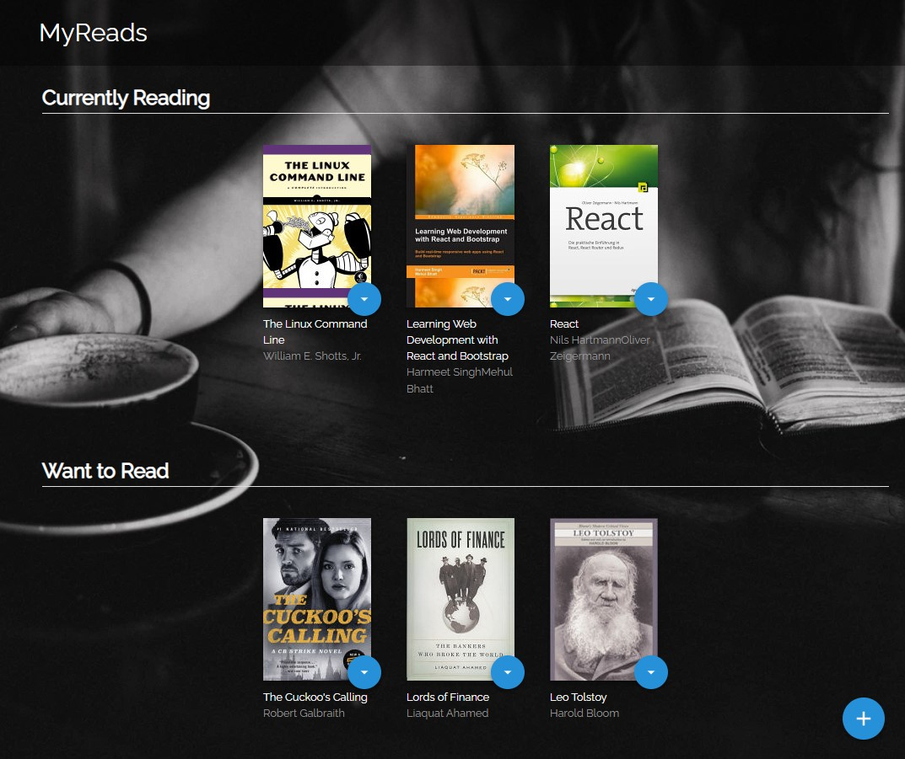
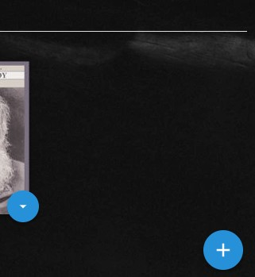
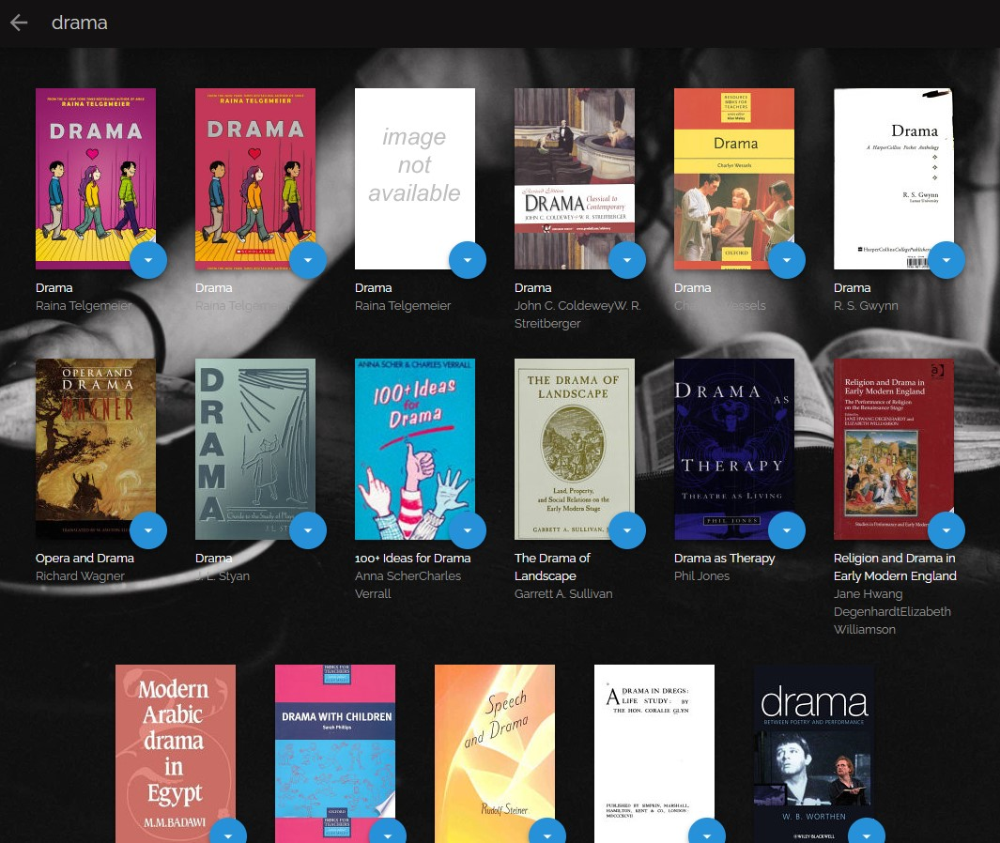
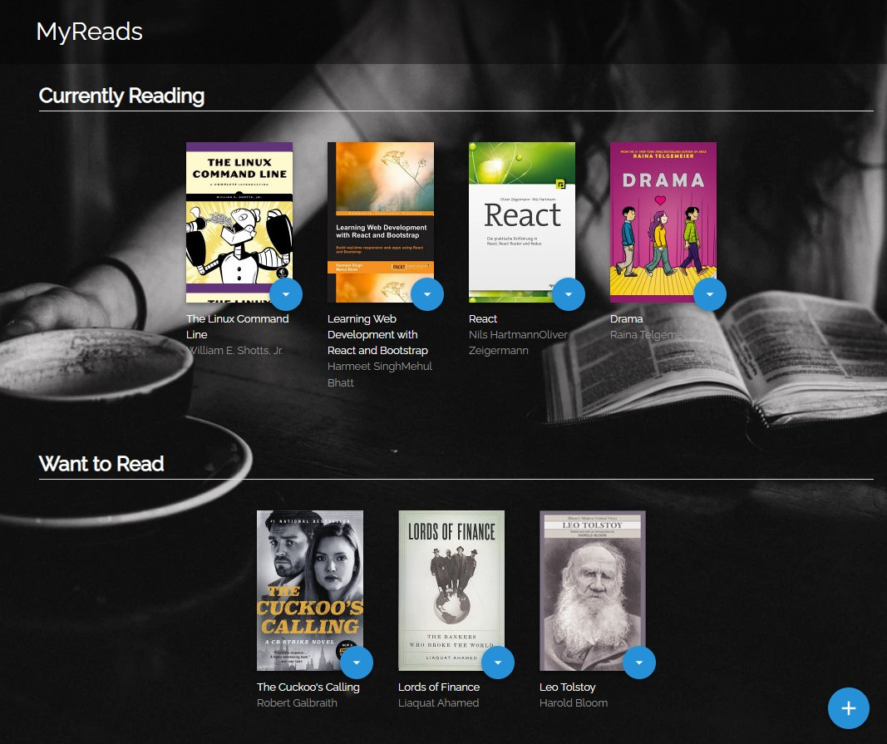
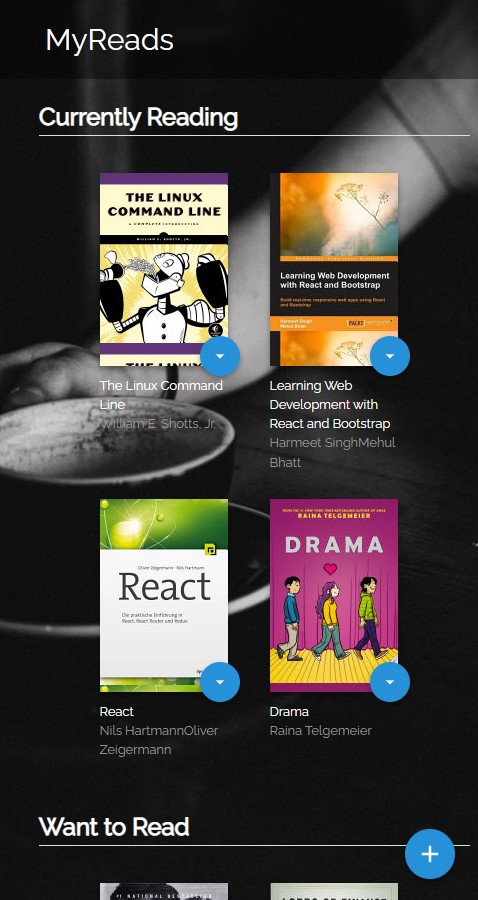

# MyReads Project

This project allows the user to view a page of books and sort those books between 3 'shelves' entitled 'currently reading', 'want to read' and 'read'. They can also delete a book from their shelves by clicking on the book and selecting 'none'.

A search function allows the user to search a database by title, and add books from those search results to their shelves.

- [MyReads Project](#myreads-project)
  - [TL;DR](#tldr)
  - [Screenshots](#screenshots)
    - [Home Page](#home-page)
      - [Shelf Button](#shelf-button)
      - [Search Button](#search-button)
    - [Search Page](#search-page)
      - [Search Results](#search-results)
      - [Result of Selecting a Shelf on the Search Page](#result-of-selecting-a-shelf-on-the-search-page)
    - [Fully Responsive](#fully-responsive)
  - [File Tree](#file-tree)
  - [Backend Server](#backend-server)
    - [`getAll`](#getall)
    - [`update`](#update)
    - [`search`](#search)
  - [Important](#important)
  - [Create React App](#create-react-app)
  - [License](#license)

## TL;DR

To get started with the app:

- install all project dependencies with `npm install`
- start the development server with `npm start`

## Screenshots

### Home Page

The home page shows your current selection of books separated into three categories: those you want to read, those you have read, and those you are currently reading. Scroll is required depending on if you have a lot of books or not.


#### Shelf Button

Each book has a blue dropdown menu attached that allows you to change the shelf of the book you have selected.


#### Search Button

To navigate to the search page you can click a blue button in the bottom left-hand corner of the screen. This button redirects the user to the search page.



### Search Page

The search page is essentialist, but is user friendly. The user should be drawn to the search bar at the top of the page and click to begin searching for a book.


#### Search Results

As the user types, the search results are rendered in real time. The search results have a maximum of 20 results, and each book has it's own shelf button.


#### Result of Selecting a Shelf on the Search Page

The shelf button for each book on the search page will place the book chosen on the coressponding shelf on the home page.


#### Fully Responsive

The app is fully responsive, and has a mobile-first design.



## File Tree

```bash
├── README.md - This file.
├── package.json # npm package manager file.
├── public
│   ├── favicon.ico # React Icon
│   └── index.html # DO NOT MODIFY
└── src
    ├── assets # svg files
    │   ├── add.svg
    │   ├── arrow-back.svg
    │   └── arrow-drop-down.svg
    │
    └── components # React components
    │   ├── App.js # The root of the application.
    │   ├── Book.js # A single book.
    │   ├── Bookshelf.js # A single shelf.
    │   ├── BookshelfChanger.js # Changes the bookshelf of a book.
    │   ├── BookStateTable.js # A table of books.
    │   └── Title.js # The title bar.
    │
    └── services
    │   └── BoooksAPI.js # # A JavaScript API for the provided Udacity backend. Instructions for methods below.
    │
    └── styles # CSS files.
    │   ├── App.css # Styles for the app.
    │   └── index.css # Global styles.
    │
    ├── views
    │   ├── Home.js # The home page.
    │   └── SearchBooks.js # The search page.
    │
    └── index.js # Used for DOM rendering only.
```

## Backend Server

This app uses a backend server provided by [Udacity](https://udacity.com). The provided file [`BooksAPI.js`](src/BooksAPI.js) contains the methods to perform necessary operations on the backend:

- [`getAll`](#getall)
- [`update`](#update)
- [`search`](#search)

### `getAll`

Method Signature:

```js
getAll();
```

- Returns a Promise which resolves to a JSON object containing a collection of book objects.
- This collection represents the books currently in the bookshelves in your app.

### `update`

Method Signature:

```js
update(book, shelf);
```

- book: `<Object>` containing at minimum an `id` attribute
- shelf: `<String>` contains one of ["wantToRead", "currentlyReading", "read"]
- Returns a Promise which resolves to a JSON object containing the response data of the POST request

### `search`

Method Signature:

```js
search(query);
```

- query: `<String>`
- Returns a Promise which resolves to a JSON object containing a collection of a maximum of 20 book objects.
- These books do not know which shelf they are on. They are raw results only. You'll need to make sure that books have the correct state while on the search page.

## Important

The backend API uses a fixed set of cached search results and is limited to a particular set of search terms.

## Create React App

This project was bootstrapped with [Create React App](https://github.com/facebook/create-react-app). You can find more information on how to perform common tasks [here](https://github.com/facebook/create-react-app/blob/main/packages/cra-template/template/README.md).

## License

This project is licensed under the MIT license.
